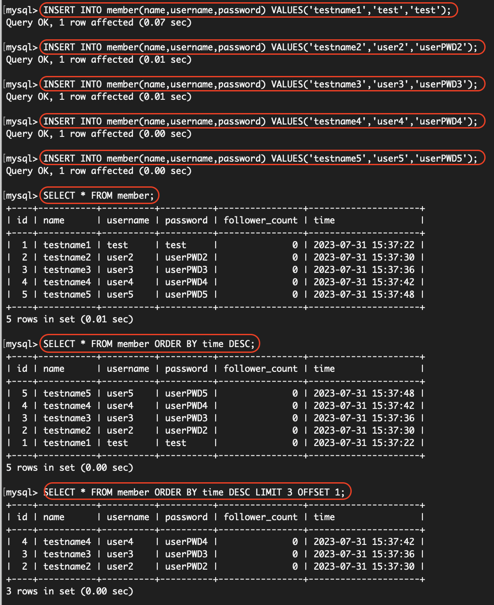
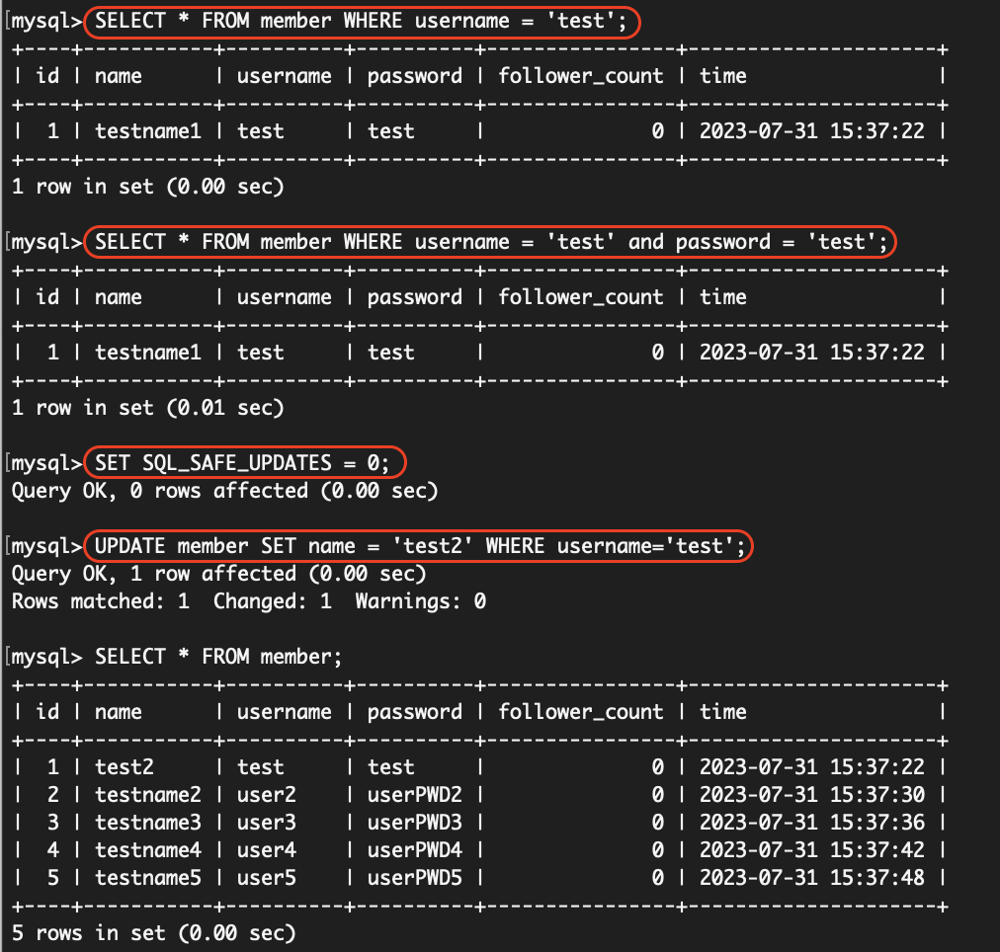
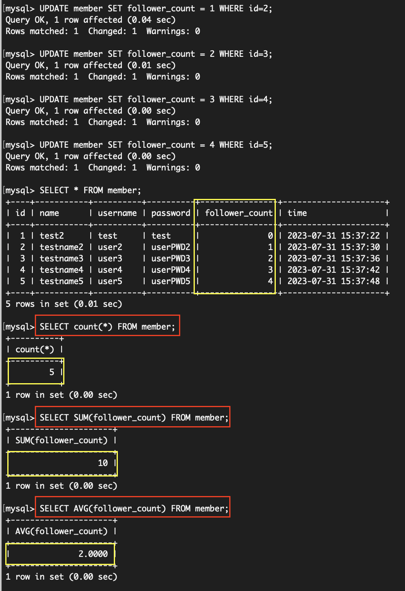

### 要求三:SQL CRUD
#### command line
```
-- create members
INSERT INTO member(name,username,password) VALUES('testname1','test','test');
INSERT INTO member(name,username,password) VALUES('testname2','user2','userPWD2');
INSERT INTO member(name,username,password) VALUES('testname3','user3','userPWD3');
INSERT INTO member(name,username,password) VALUES('testname4','user4','userPWD4');
INSERT INTO member(name,username,password) VALUES('testname5','user5','userPWD5');

-- read all members
SELECT * FROM member;

-- read all members from newest to oldest
SELECT * FROM member ORDER BY time DESC;

-- read 2nd~4th newest members
SELECT * FROM member ORDER BY time DESC LIMIT 3 OFFSET 1;

-- read 'test' user
SELECT * FROM member WHERE username = 'test';

-- read 'test' user whose password is 'test'
SELECT * FROM member WHERE username = 'test' and password = 'test';

-- close safty setting
SET SQL_SAFE_UPDATES = 0;

-- update name for 'test' user
UPDATE member SET name = 'test2' WHERE username='test';
```
#### results



### 要求四:SQL Aggregate Functions 
#### command line
```
-- update follower counts for task4
UPDATE member SET follower_count = 1 WHERE id=2;
UPDATE member SET follower_count = 2 WHERE id=3;
UPDATE member SET follower_count = 3 WHERE id=4;
UPDATE member SET follower_count = 4 WHERE id=5;
SELECT * FROM member;

-- get total number of members
SELECT count(*) FROM member;

-- get sum of follower count of all members
SELECT SUM(follower_count) FROM member;

-- get average of follower count of all members
SELECT AVG(follower_count) FROM member;
```
#### results

