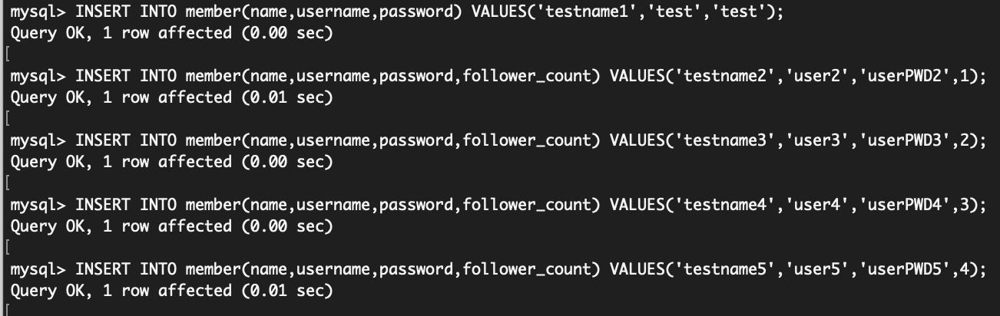
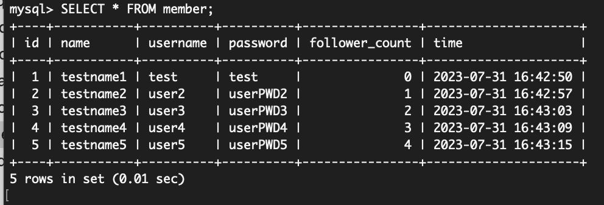
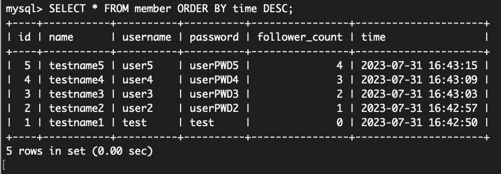
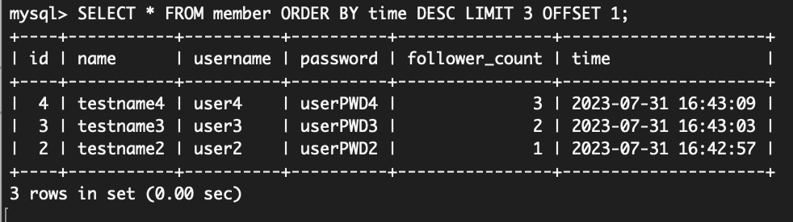
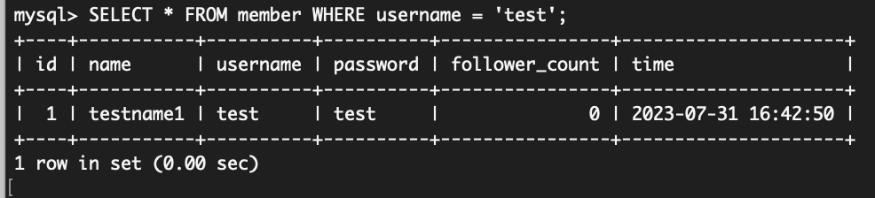
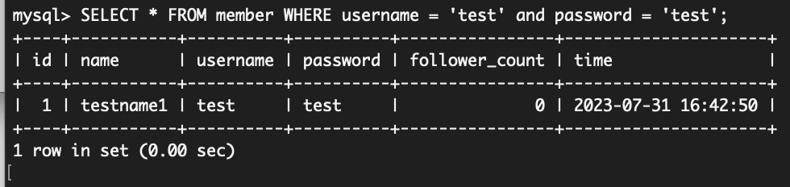
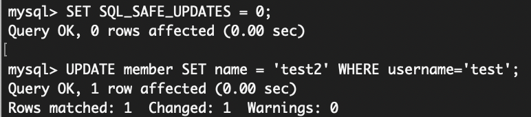
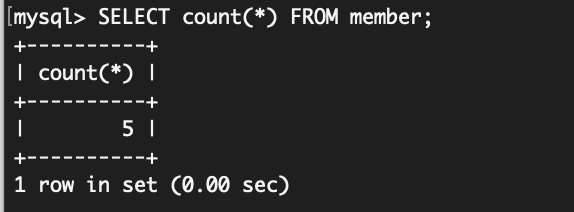
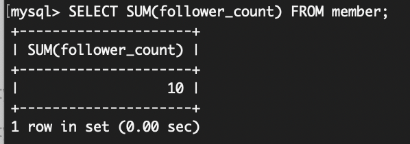
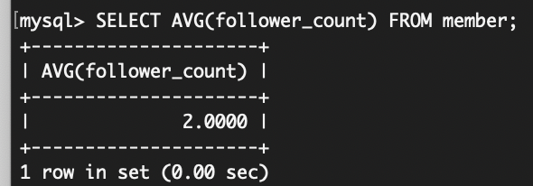

## 要求三:SQL CRUD
### 1. create members
command line
```
INSERT INTO member(name,username,password) VALUES('testname1','test','test');
INSERT INTO member(name,username,password,follower_count) VALUES('testname2','user2','userPWD2',1);
INSERT INTO member(name,username,password,follower_count) VALUES('testname3','user3','userPWD3',2);
INSERT INTO member(name,username,password,follower_count) VALUES('testname4','user4','userPWD4',3);
INSERT INTO member(name,username,password,follower_count) VALUES('testname5','user5','userPWD5',4);
```
results



### 2. read all members
command line
```
SELECT * FROM member;
```
results



### 3. read all members from newest to oldest
command line
```
SELECT * FROM member ORDER BY time DESC;
```
results



### 4. read 2nd~4th newest members
command line
```
SELECT * FROM member ORDER BY time DESC LIMIT 3 OFFSET 1;
```
results



### 5. read 'test' user
command line
```
SELECT * FROM member WHERE username = 'test';
```
results



### 6. read 'test' user whose password is 'test'
command line
```
SELECT * FROM member WHERE username = 'test' and password = 'test';
```
results



### 7. update name for 'test' user
command line
```
SET SQL_SAFE_UPDATES = 0;
UPDATE member SET name = 'test2' WHERE username='test';
```
results



## 要求四:SQL Aggregate Functions 
### 1. get total number of members
command line
```
SELECT count(*) FROM member;
```
results



### 2. get sum of follower count of all members
command line
```
SELECT SUM(follower_count) FROM member;
```
results



### 3. get average of follower count of all members
command line
```
SELECT AVG(follower_count) FROM member;
```
results


