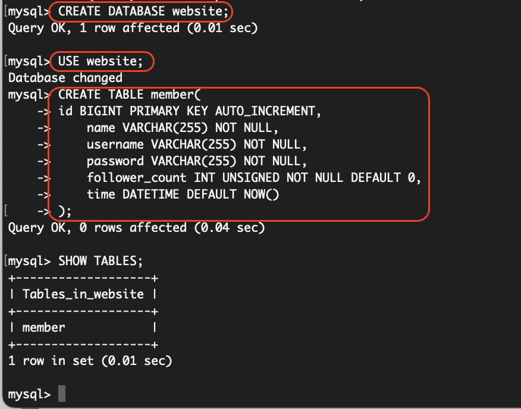

### 要求二:建立資料庫和資料表
#### command line
```
CREATE DATABASE website;
USE website;
CREATE TABLE member(
    id BIGINT PRIMARY KEY AUTO_INCREMENT,
    name VARCHAR(255) NOT NULL,
    username VARCHAR(255) NOT NULL,
    password VARCHAR(255) NOT NULL,
    follower_count INT UNSIGNED NOT NULL DEFAULT 0,
    time DATETIME DEFAULT NOW()
);
```
#### results


### 要求三:SQL CRUD
#### command line
```
-- create members
INSERT INTO member(name,username,password) VALUES('testname1','test','test');
INSERT INTO member(name,username,password) VALUES('testname2','user2','userPWD2');
INSERT INTO member(name,username,password) VALUES('testname3','user3','userPWD3');
INSERT INTO member(name,username,password) VALUES('testname4','user4','userPWD4');
INSERT INTO member(name,username,password) VALUES('testname5','user5','userPWD5');

-- read all members
SELECT * FROM member;

-- read all members from newest to oldest
SELECT * FROM member ORDER BY time DESC;

-- read 2nd~4th newest members
SELECT * FROM member ORDER BY time DESC LIMIT 3 OFFSET 1;

-- read 'test' user
SELECT * FROM member WHERE username = 'test';

-- read 'test' user whose password is 'test'
SELECT * FROM member WHERE username = 'test' and password = 'test';

-- close safty setting
SET SQL_SAFE_UPDATES = 0;

-- update name for 'test' user
UPDATE member SET name = 'test2' WHERE username='test';
```
#### results


